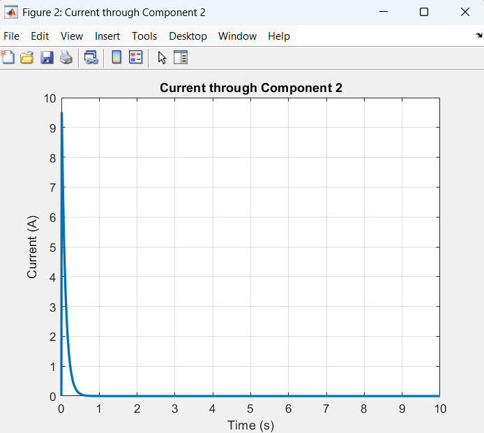
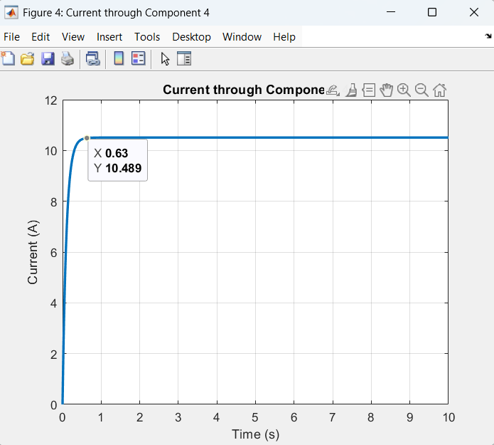
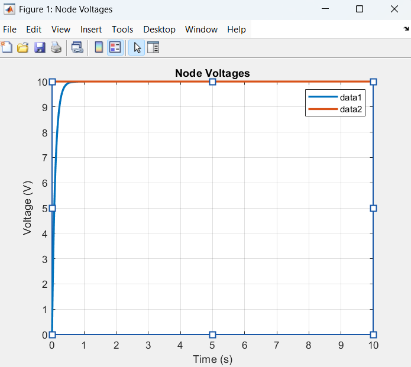

# ⚡ Circuit Transient Analyser

A MATLAB-based transient circuit simulator that performs time-domain analysis of linear electrical circuits using symbolic Laplace transformations and numerical methods. It supports **resistors (R), capacitors (C), inductors (L)**, and **step voltage sources**, and can compute **node voltages** and **component currents** over time.

## 📂 Files

* `runCircuitAnalysis.m`: Main MATLAB script to parse input and perform analysis.
* `input_sample.txt`: Sample input file specifying circuit structure and parameters.
* `Output_sample_1.png`, `Output_sample_2.png`, `Output_sample_3.png`: Sample plots of simulation outputs.

## 📌 Features

* Parses circuit netlists from structured `.txt` files.
* Supports:

  * Resistors (R)
  * Capacitors (C)
  * Inductors (L)
  * Step voltage sources
* Computes:

  * Time-domain node voltages
  * Current through each component
* Graphical plots for easy analysis.

## ▶️ How to Run

Open MATLAB and run:

```matlab
runCircuitAnalysis('input_sample.txt');
```

You’ll be prompted to select which component's current you'd like to plot after node voltages are plotted.

---

## 📝 Sample Input

To view the format of a valid input file, refer to:
📄 [`input_sample.txt`](./input_sample.txt)

---

## 📊 Sample Outputs

Here are a few example plots generated from the sample input:










---

## 🛠️ Built With

* MATLAB (Symbolic Math Toolbox)
* Laplace transforms + Inverse Laplace
* Euler method for discrete integration (inductors)
* Matrix-based circuit analysis (Modified Nodal Analysis)

---

